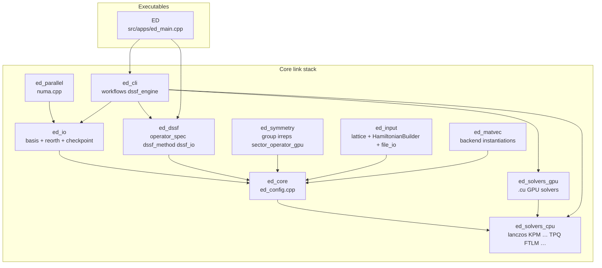
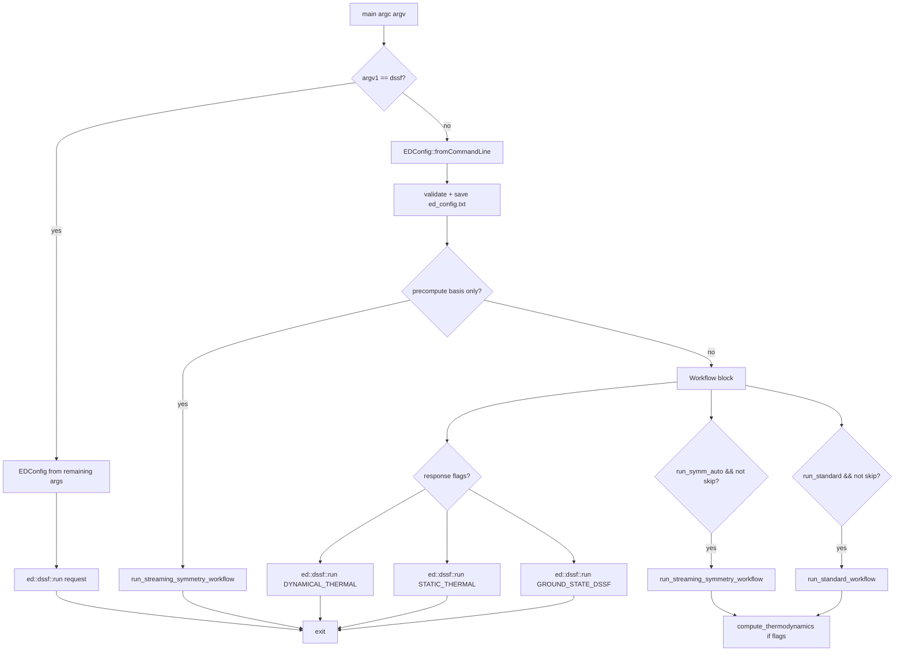
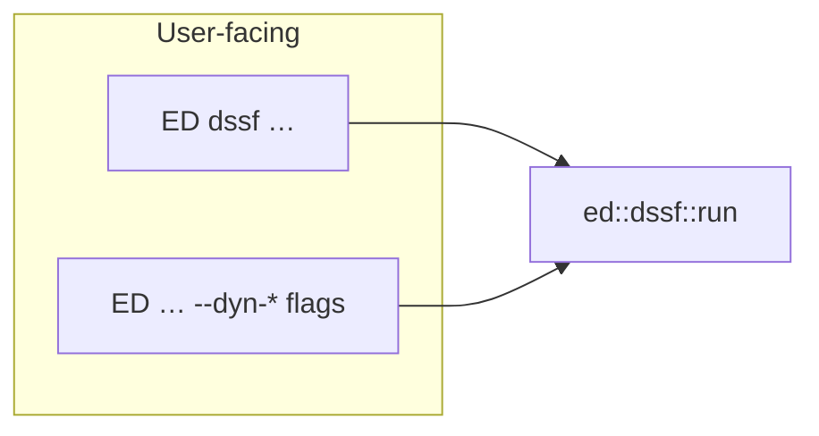

# Code map: libraries, leaves, `ED` pipeline, redundancies

> **Update (June 2026):** The minimalist ED architecture refactor
> (see [`ARCHITECTURE.md`](ARCHITECTURE.md)) is fully finalized.
> The kernels, operators, backends, and dispatch tables have been
> completely collapsed into a smaller, cleaner set of orthogonal
> pieces. This document represents the exact post-collapse production
> state, providing a canonical guide to the directory layout,
> libraries, and active solver endpoints.

This document is a **structural atlas** of the C++ tree under `include/ed/`
and `src/`, how the **`ED` binary** navigates solvers and workflows, and
where **intentional duplication** lives vs. true technical debt.

For the post-collapse architecture see
[`ARCHITECTURE.md`](ARCHITECTURE.md). For scaling and env knobs see
[`SCALING.md`](SCALING.md). For the symmetry math + the
`Subspace × ProjectorChain` decomposition see
[`SYMMETRY.md`](SYMMETRY.md).

---

## 1. CMake static libraries and executables (build graph)

Libraries are defined in [`cmake/EDLibraries.cmake`](../../cmake/EDLibraries.cmake).
The `ED` driver links a **subset** of them; not every installed archive is
linked into every binary (e.g. `ed_symmetry` is linked by `qed._core`
and unit tests, but **not** by the main `ED` executable — symmetry sectors
for `ED` typically come from JSON via `construct_ham` / file I/O).



*(The BFG order-parameter pipeline -- `ed_bfg`, both
`compute_bfg_order_parameters*` executables -- was removed in the July
2026 consolidation sweep, Family 11.)*

`ed_input` is **not** in the `ED` link line — it is a *standalone* lattice
+ Hamiltonian builder library consumed by the new `examples/`, by the
`qed._core` pybind11 module (which exposes it as
`qed.input`), and by the Catch2 unit tests
(`tests/unit/test_input_library.cpp`). Its job is to **replace** the
legacy `python/edlib/helper_*.py` family with a typed, in-process API
that can either materialise an `ed::Operator` *or* emit the same
`InterAll.dat` / `Trans.dat` / `positions.dat` directory that `./ED`
already consumes.

*Figure: Dependency direction (not the exact CMake `target_link_libraries`
list). `ed_cli` always pulls `ed_solvers_cpu`; it **also** links
`ed_solvers_gpu` when `WITH_CUDA` is on. `ed_solvers_gpu` in turn
**PUBLIC**-links `ed_solvers_cpu`, so the `ED` executable only names
`ed_cli` + `ed_dssf` + `ed_solvers_gpu` in the CUDA case (CPU solvers
transitive). Non-CUDA `ED` links `ed_cli` + `ed_solvers_cpu` + `ed_dssf` and
omits `ed_solvers_gpu` entirely.*

---

## 2. `ED` process flow (argv → solvers)

`ed_main.cpp` is intentionally thin: **parse** → **optional workflows** →
**optional DSSF dispatch**. The heavy logic is in
[`src/cli/workflows.cpp`](../../src/cli/workflows.cpp), which builds
the input deck with [`ed::make_operator`](../../include/ed/core/make_operator.h)
and dispatches through [`ed::workflows::{solve,thermal,spectral}`](../../include/ed/orchestrator.h).
The thousands of lines of dispatch code that used to live in
`include/ed/core/ed_wrapper.h` / `ed_wrapper_streaming.h` (legacy
`exact_diagonalization_*` family + symmetry wrappers + GPU routing)
were hard-removed in the May 2026 surface-unification collapse.



*Figure: Main-line `ED` (not the `dssf` subcommand). The `--disk-streaming`
and `--chunked-symm` workflows were retired in matvec-unification Phase 7.2;
the streaming-symmetry path scales to every case they used to cover (the
CSR-free rep lane is O(#reps) memory). Multiple workflows can still be toggled in one config;
the most confusing case is `run_standard` **and** `run_symm_auto` both true
— **both** runs execute and eigenvalues are **compared** (see `ed_main.cpp`).*

**Where solvers actually run:** `run_*_workflow` calls into the single
canonical orchestrator entry `ed::workflows::{solve,thermal,spectral}(*op, opts)`
in [`orchestrator.h`](../../include/ed/orchestrator.h), passing a
`LinearOperator` built by `ed::make_operator(OperatorSpec{...})`
([`make_operator.h`](../../include/ed/core/make_operator.h)). The
orchestrator dispatches over the orthogonal axes (`use_symmetry`,
`use_fixed_sz`, GPU/MPI lanes via `BackendConstraints`) and forwards
to the per-kernel implementations under
[`include/ed/krylov/`](../../include/ed/krylov/),
[`include/ed/solvers/`](../../include/ed/solvers/),
[`include/ed/thermal/`](../../include/ed/thermal/), and the GPU
counterparts in [`include/ed/gpu/`](../../include/ed/gpu/). The
choice of `SolveMethod` / `ThermalMethod` / `SpectralMethod` (the
per-algorithm enums, in
[`orchestrator.h`](../../include/ed/orchestrator.h)) is orthogonal
and resolved inside the orchestrator.

---

## 3. DSSF: two CLI surfaces, one engine (not redundant)

> Full landscape with **all four** spectral lanes (in-memory orchestrator,
> streaming-symmetry same/cross-irrep walkers, CLI DSSF engine) and the
> `qed.spectral` dispatcher: see [`DSSF.md`](DSSF.md).

| Entry | Code path |
|-------|-----------|
| `ED dssf <method> <dir> …` | `ed_main.cpp` → `ed::dssf::run` |
| `ED <dir> … --dynamical-response` / `--static-response` / `--ground-state-dssf` | Same `ed::dssf::run` via lambdas in `ed_main.cpp` |

[`src/cli/dssf_engine.cpp`](../../src/cli/dssf_engine.cpp) + `ed_dssf` hold
`build_observable_pairs` and the method dispatch. **No second copy** of the
continued-fraction / FTLM kernels for the subcommand — P2.14 removed the old
`TPQ_DSSF` binary and `--dssf` shim.



---

## 4. MPI

One product (Stage 11d, Jul 2026): `ED` under `mpirun`. Across-sector
distribution (SectorDistributor: Burnside dim-balanced sector ownership,
rank-local solves) engages automatically for symmetry workloads; the
in-process `MpiBackend` covers reduction parallelism. The separate
`ed_distributed_main` launcher and the `ed::distributed::*` operator family
(1D slab SpMV + distributed lanczos/ftlm/tpq/krylov-schur + GPU twins,
~6.6 kLOC) were retired — recoverable from git history if within-sector
memory distribution is ever needed again. Only the NCCL
`MultiGpuCommunicator` survives (`ed/parallel/multi_gpu.h`, library
`ed_multi_gpu`), consumed by `MpiCudaBackend`.

---

## 5. Exhaustive file leaves (`include/ed` + `src`)

Below is **every** `.h` / `.hpp` / `.cuh` / `.cpp` / `.cu` file under
`include/ed` and `src` (repository snapshot 2026-07-20; regrow with
`find include/ed src -type f | sort` after refactors). One subsystem
per folder; the per-subsystem design docs are `ARCHITECTURE.md`,
`UNIFIED_STACK.md`, `SYMMETRY.md`, and `DSSF.md`.

### `include/ed/` *(top level: the three workflow verbs + the typed one-call API)*

- `api.h`, `orchestrator.h`

### `include/ed/api/`

- `symmetry_helpers.h`

### `include/ed/cli/`

- `workflows.h`

### `include/ed/core/` *(Operator family, make_operator factory, results/parameters, select_backend, mem_guard)*

- `basis_utils.h`, `blas_lapack_wrapper.h`, `combinadic.h`, `construct_ham.h`, `ed_config.h`, `ed_config_adapter.h`, `ed_parameters.h`, `ed_types.h`, `ed_wrapper.h`, `fixed_sz_operator.h`, `hdf5_io.h`, `linear_operator.h`, `make_operator.h`, `matvec_types.h`, `mem_guard.h`, `operator.h`, `operator_builders.h`, `operator_fwd.h`, `operator_types_detail.h`, `results.h`, `sector_loop.h`, `sector_thermo.h`, `select_backend.h`, `solver_defaults.h`, `sorted_uint64_index.h`, `subspace_operator.h`, `symmetry_metadata.h`, `system_utils.h`, `thermal_types.h`

### `include/ed/dssf/` *(cross-sector observables + the CLI DSSF engine surface)*

- `cross_sector_observable.h`, `cross_sector_orbit_observable.h`, `dssf_engine.h`, `dssf_io.h`, `operator_spec.h`

### `include/ed/gpu/` *(CUDA lane: device operator, kernels config, KPM-DOS GPU; `gpu_ed_wrapper.h` is the test-only legacy GPU Lanczos entry)*

- `bit_operations.cuh`, `combinadic.cuh`, `gpu_ed_wrapper.h`, `gpu_mixed_precision.h`, `gpu_operator.cuh`, `gpu_solvers.h`, `kernel_config.h`, `kpm_dos_gpu.cuh`

### `include/ed/input/` *(lattice + fluent HamiltonianBuilder + `.dat` writers; backs `qed.input`)*

- `file_io.h`, `hamiltonian_builder.h`, `input.h`, `lattice.h`, `types.h`

### `include/ed/io/`

- `basis_vector_storage.h`, `lanczos_basis_buffer.h`, `lanczos_checkpoint.h`, `lanczos_reorth.h`

### `include/ed/krylov/` *(backend-templated Lanczos / Block-Lanczos / Krylov-Schur kernels + Ritz convergence)*

- `block_krylov_schur_kernel.h`, `block_lanczos_kernel.h`, `krylov_schur_kernel.h`, `lanczos_kernel.h`, `lanczos_tridiag.h`, `ritz_convergence.h`, `subspace_policy.h`, `tridiag_eigensolver.h`

### `include/ed/matvec/` *(BasisPolicy matvec family: term storage/kernels, rep-walk + reduced-CSR symmetry lanes, device twins)*

- `backend.h`, `basis_policy.h`, `comm_plan.h`, `cuda_matvec_backend.cuh`, `device_basis_policy.cuh`, `matvec.h`, `matvec_backend.h`, `memory_space.h`, `mpi_matvec_impl.h`, `nonabelian_symmetry_basis_policy.h`, `reduced_symmetry_csr.h`, `rep_symmetry_basis_policy.h`, `symmetry_basis_policy.h`, `symmetry_matvec_backend.h`, `term_gate_math.h`, `term_kernels.h`, `term_kernels_assemble.h`, `term_kernels_gather.h`, `term_kernels_gpu.cuh`, `term_storage.h`

### `include/ed/matvec/backends/` *(CpuBackend / CudaBackend / MpiBackend / MpiCudaBackend)*

- `cpu_backend.h`, `cuda_backend.cuh`, `mpi_backend.h`, `mpi_cuda_backend.cuh`

### `include/ed/observables/` *(expectation, static + dynamical correlator kernels, cross-irrep FTLM)*

- `cf_dynamical.h`, `cf_spectral_kernel.h`, `expectation.h`, `ftlm_cross_irrep_kernel.h`, `kpm_dynamical.h`, `static_correlator.h`

### `include/ed/operators/`

- `operators.h`, `spin_ops.h`

### `include/ed/parallel/` *(NUMA, thread budget, NCCL MultiGpuCommunicator)*

- `fused_blas1.h`, `multi_gpu.h`, `numa.h`, `thread_budget.h`

### `include/ed/planner/` *(env-override leaf policy hooks -- no planner; see ARCHITECTURE.md)*

- `basis_policy_hook.h`, `csr_policy_hook.h`, `sym_matvec_policy_hook.h`

### `include/ed/solvers/` *(CPU drivers incl. the factorized little-group engine `little_group_solve.h`)*

- `ftlm.h`, `ftlm_dist.h`, `ftlm_kpm.h`, `kpm_dos.h`, `lanczos.h`, `little_group_blocks.h`, `little_group_solve.h`, `ltlm.h`, `observables.h`

### `include/ed/symmetry/` *(Subspace x ProjectorChain composition, CompiledGroup, irreps, sector plan/set/basis, GPU mirrors)*

- `canonical_thermo.h`, `commute_check.h`, `compiled_group.h`, `env_gates.h`, `fixed_sz_membership.h`, `gosper.h`, `group.h`, `irreps.h`, `observable_character.h`, `orbit_table.h`, `projector.h`, `projector_chain.h`, `rep_projection.h`, `rep_sector_data.h`, `sector_basis.h`, `sector_gpu_mirror.h`, `sector_operator.h`, `sector_plan.h`, `sector_set.h`, `spin_flip.h`, `subspace.h`, `sym_profile.h`, `symmetry_cache.h`, `symmetry_sector_data.h`, `time_reversal.h`

### `include/ed/thermal/` *(FTLM / LTLM-via-FTLM / OFTLM / mTPQ / KPM-DOS kernels; `tpq_kernel.h` also carries the CanonicalTaylor mechanism, but the user-facing cTPQ method was removed in the final consolidation)*

- `ftlm_kernel.h`, `kpm_dos_kernel.h`, `mtpq_f32.h`, `mtpq_kernel.h`, `oftlm_kernel.h`, `tpq_kernel.h`, `tpq_seeding.h`, `tpq_thermo.h`

### `src/api/`

- `api_facade.cpp`, `build_introspection.cpp`, `symmetry_helpers.cpp`

### `src/apps/`

- `ed_main.cpp`

### `src/cli/`

- `dssf_engine.cpp`, `workflows.cpp`

### `src/core/`

- `ed_config.cpp`, `operator_gpu.cpp`, `operator_gpu.cu`

### `src/dssf/`

- `cross_sector_observable.cpp`, `cross_sector_orbit_observable.cpp`, `dssf_io.cpp`, `dssf_method.cpp`, `operator_spec.cpp`

### `src/input/`

- `file_io.cpp`, `hamiltonian_builder.cpp`, `lattice.cpp`

### `src/io/`

- `basis_vector_storage.cpp`, `lanczos_basis_buffer.cpp`, `lanczos_checkpoint.cpp`, `lanczos_reorth.cpp`

### `src/matvec/`

- `cpu_backend_instantiations.cpp`, `sanity_check.cpp`

### `src/observables/`

- `ftlm_cross_irrep_kernel.cpp`

### `src/parallel/`

- `multi_gpu.cu`, `numa.cpp`, `thread_budget.cpp`

### `src/solvers/cpu/`

- `ftlm.cpp`, `ftlm_dynamical.cpp`, `ftlm_kpm.cpp`, `kpm_dos.cpp`, `lanczos.cpp`, `little_group_solve.cpp`, `ltlm.cpp`, `observables.cpp`, `oftlm.cpp`

### `src/solvers/gpu/` *(the Gen-1 hand-rolled bodies and `gpu_ftlm.cu` (GPUFTLMSolver, consolidation Family 3) are gone; GPU Lanczos/FTLM/mTPQ ride `lanczos_kernel<CudaBackend>` + the backend-templated thermal kernels)*

- `gpu_ed_wrapper.cu`, `gpu_kernels.cu`, `gpu_lanczos_kernel_facade.cu`, `gpu_mixed_precision.cu`, `gpu_operator.cu`, `gpu_operator_conversion.cpp`, `kpm_dos_gpu.cu`, `mtpq_f32_impl.cuh`

### `src/symmetry/`

- `group.cpp`, `irreps.cpp`, `sector_operator_gpu.cpp`, `sector_operator_gpu.cu`, `streaming_symmetry_gpu_mirror.cpp`, `streaming_symmetry_gpu_mirror.cu`

- `src/orchestrator.cpp` *(the three verbs' implementation)*

Retired wholesale (recoverable from git history): `include/ed/bfg` +
`src/bfg` + both BFG apps (consolidation Family 11),
`include/ed/distributed` + `src/distributed` + `ed_distributed_main`
(Stage 11d -- across-sector SectorDistributor x MpiBackend is the MPI
story), the chunked/disk-streaming triplet (Phase 7.2), and the
monolithic SAB engine `symmetry_adapted*` (Family 6 -- the factorized
little-group engine is the sole non-abelian engine).

---

## 6. Other top-level areas (not duplicated above)

| Path | Purpose |
|------|---------|
| `python/qed/` | `pybind11` `_core` + pure Python `workflow` / `thermal` / `spectral` / `dssf` / `symmetry` / `discovery` / `point_group_routing` / `star_reduction` / `hamiltonian` + **`input`** *(facade for the `ed_input` C++ library)* |
| `workflows/nlce/` | Python driver that **subprocess**-launches `ED` |
| `examples/` | C++/MPI/CUDA/Python samples |
| `benchmarks/` | Google Benchmark + `bench_all_backends.py` |
| `tests/unit/` | Catch2 tests (one file per major subsystem) |

---

## 6.5 Finite-temperature solvers and the auto-Sz / auto-symmetry path

The finite-T family is a *thin layer over the matvec*. Every method
listed below operates on the same `Operator::apply(in, out, dim)`
(matvec-unification Phase 2) and is therefore reachable through
exactly the same dispatch axes as the ground-state solvers
(`use_fixed_sz`, `use_symmetry`, `use_gpu`, `use_mpi`).

| Method      | Header                                  | Math (one-line)                                                            | Sample budget                  |
|-------------|------------------------------------------|----------------------------------------------------------------------------|--------------------------------|
| `FTLM`      | `include/ed/solvers/ftlm.h`             | `Z ≈ (D/R) Σ_r Σ_k |<r|ψ_k>|^2 e^{-β E_k}`, R random Lanczos starts        | `num_samples × krylov_dim`     |
| `LTLM`      | `include/ed/solvers/ltlm.h`             | FTLM with one Lanczos chain from the *ground state* (T → 0 specialisation)  | `1 × ground_state_krylov`      |
| `KPM_DOS`   | `include/ed/solvers/kpm_dos.h`          | Chebyshev-expand DOS, Hutchinson stochastic trace, Jackson-kernel smoothing | `num_random × num_moments`     |
| `mTPQ`      | `include/ed/thermal/mtpq_kernel.h`      | Microcanonical TPQ: `(L−H)^N |r⟩` chain, β inferred from `⟨H⟩, ⟨H²⟩`         | `num_samples × max_iterations` |

Each of these solvers populates the same `ThermodynamicData` payload
inside `EDResults` -- `temperatures`, `energy`, `specific_heat`,
`entropy`, `free_energy`, and (for FTLM) the raw `Z_sample`,
`E_weighted`, `E2_weighted`, `e_min` used for sample-level averaging
with proper Jensen-inequality handling.

**Coverage of the unified `thermal()` entry point** (2026-07-20, verified
by `benchmarks/bench_capability_matrix.py` against the exact partition
sum): every method (FTLM / LTLM / OFTLM / mTPQ / KPM-DOS) rides the same
flat sector pool — U(1) Sz (or the Sz-parity half), spatial irreps, the
∏σˣ flip split, time-reversal pairing, and point-group star copies all
compose, on CPU and GPU. Sectors with dim ≤ 512 take the exact
small-block route (machine precision) for every sampling method whose
deliverable is thermodynamics; larger sectors sample per-sector and
Z-recombine. KPM-DOS is excluded from the exact fallback on purpose (its
Chebyshev density of states is a deliverable the exact path does not
produce). The historical "TPQ can't factor through spatial irreps"
restriction is gone; `used_symmetry_decomposition` reports truthfully.

### How the auto-Sz / auto-symmetry layers integrate

The recommended path is one function call:

```cpp
#include <ed/orchestrator.h>

// In-memory: auto-Sz only.
auto thermo = ed::workflows::thermal(
    H, DiagonalizationMethod::FTLM,
    { .T_min = 0.05, .T_max = 5.0, .num_T = 64 });

// Directory-based: auto-Sz AND auto-symmetry (`automorphism_results/`).
auto thermo = ed::workflows::thermal(
    "ed_dir/", N, /*spin=*/0.5f, DiagonalizationMethod::FTLM,
    { .T_min = 0.05, .T_max = 5.0, .num_T = 64,
      .sz_min = N/2 - 2, .sz_max = N/2 + 2 });   // optional Sz window
```

`thermal(...)` iterates the sector pool planned by the composition
layer (`sector_plan.h`): it detects the diagonal axis (U(1) Sz or
Sz parity), builds one lazy `SectorOperator` per (diagonal, irrep)
cell via `ed::make_sector_operators_tagged`, runs the selected kernel
per sector (or copies the partner's result across flip transport /
time-reversal pairing / star folds), and Z-recombines the per-sector
`ThermodynamicData` blocks via `ed::core::combine_sector_thermodynamics`
(`include/ed/core/sector_thermo.h`) into the full-Hilbert thermo.

### The sector-recombination math (used by both the streaming kernel and `combine_ftlm_sector_results`)

For sectors {s} with per-sector free energies `F_s(β)`:

```text
F_ref(β)         = min_s F_s(β)                            (numerical anchor)
Z_s^{shift}(β)   = exp(−β (F_s − F_ref))
Z_total(β)       = Σ_s Z_s^{shift}(β)
w_s(β)           = Z_s^{shift}(β) / Z_total(β)
<E>_total(β)     = Σ_s w_s(β) · <E>_s(β)
<E^2>_s(β)       = C_s(β) / β^2 + <E>_s^2(β)               (reconstruct from Cv)
<E^2>_total(β)   = Σ_s w_s(β) · <E^2>_s(β)
F_total(β)       = F_ref − T ln(Z_total)
S_total(β)       = β (<E>_total − F_total)                 (thermo identity)
C_v,total(β)     = β^2 (<E^2>_total − <E>_total^2)
```

This is what `ed::core::combine_sector_thermodynamics` does. The
`combine_ftlm_sector_results` helper in `src/solvers/cpu/ftlm.cpp` is
the historical, FTLM-specific equivalent (kept for back-compat); the
generic version is what the streaming kernel now calls.

---

## 7. Redundancies and near-duplication

### 7.1 Intentional (design, not sloppiness)

- **Symmetry front-end** is now a single factory + orchestrator combo:
  `ed::make_sector_operators_tagged(OperatorSpec{ .streaming_symmetry = true, ... })`
  builds the tagged `SectorOperator` set (each a
  `SubspaceOperator<SymmetryBasisPolicy>`), and the per-sector iteration
  is driven by `ed::workflows::{solve,thermal,spectral}(*sec, opts)`
  in the CLI helper `run_streaming_symmetry_workflow`
  (`src/cli/workflows.cpp`) and the Python binding
  `_core.workflows_solve_streaming_symmetry_directory`. The chunked
  / disk-streaming variants (`ed_wrapper_chunked.h`,
  `chunked_symmetry_builder.h`, `disk_streaming_symmetry.h`) were
  retired in matvec-unification Phase 7.2 — the distributed/MPI
  build covers the very-large-Hilbert case the chunked path was
  built for.
- **CPU + GPU solvers**: the Krylov plane is unified
  (`lanczos_kernel<CpuBackend|CudaBackend>`); the one remaining split
  surface (KPM-DOS CPU vs `kpm_dos_gpu.cu`) is bound by regression
  tests (`test_cpu_gpu_equivalence.cpp`); `GPUFTLMSolver` was retired
  in consolidation Family 3 (dynamical + static FTLM unified onto the
  backend-generic `via_backend` kernels). Both paths plug into the unified
  `ed::matvec::MatVecOperator` interface -- the Hamiltonian wrappers
  (`Operator`, `GPUOperator`, etc.) advertise their memory space tag
  so solvers can dispatch on it.
- **DSSF** kernel overlap between `workflows.cpp` response helpers and
  `dssf_engine.cpp` was **unified** under `ed::dssf::run` (P2.x); remaining
  overlap should be only thin wrappers.
- *(The deprecated ARpack-style `*_GPU` / `*_MPI` / `*_FIXED_SZ` enum
  aliases were retired in the minimalist-architecture rev -- device and
  parallelism are flags on `EDParameters`, not enum values.)*

### 7.2 Worth knowing (possible future consolidation)

- **`include/ed/core/construct_ham.h`**: monolithic header — central to
  `Operator` and file formats; hard to split without a large refactor.
- **`mTPQ_CUDA` vs `mTPQ_GPU`**: two parse tokens → same *family*; prefer
  documenting one preferred string (`mTPQ_GPU` matches other `*_GPU` methods).
- *(the `ed_distributed`-vs-`mTPQ_MPI` naming confusion resolved itself in
  Stage 11d: the distributed family is gone and MPI means one thing.)*

### 7.3 User-configuration redundancy

- Enabling **both** `run_standard` and `run_symm_auto` **on purpose** runs two
  full diagonals and prints max eigenvalue difference — useful for *validation*,
  expensive for *production*.

---

## 8. Maintenance

When you add a new `.cpp` / `.cu` or static library, update:

1. [`cmake/EDLibraries.cmake`](../../cmake/EDLibraries.cmake)
2. This file's **§5** file list
3. If user-visible: [`README.md`](../../README.md) and/or the relevant
   guide under [`docs/guides/`](../guides/)

---

## Version

Generated as part of the repository documentation pass (2026). Commit the
`find` output diff whenever the tree changes materially.
