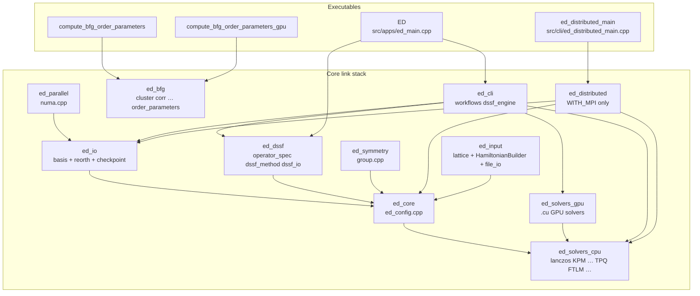
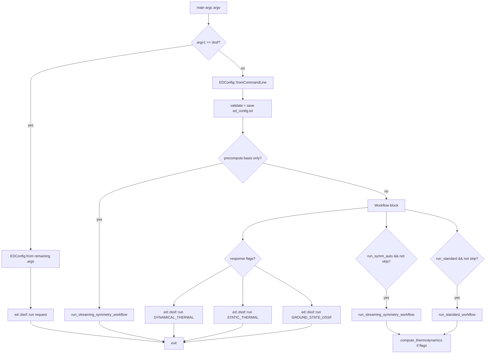
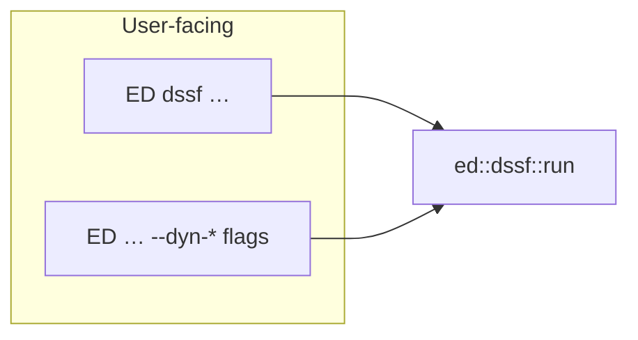

# Code map: libraries, leaves, `ED` pipeline, redundancies

> **Update (June 2026):** The minimalist ED architecture refactor
> (see [`ARCHITECTURE.md`](ARCHITECTURE.md)) is fully finalized.
> The kernels, operators, backends, and dispatch tables have been
> completely collapsed into a smaller, cleaner set of orthogonal
> pieces. This document represents the exact post-collapse production
> state, providing a canonical guide to the directory layout,
> libraries, and active solver endpoints.

This document is a **structural atlas** of the C++ tree under `include/ed/`
and `src/`, how the **`ED` binary** navigates solvers and workflows, and
where **intentional duplication** lives vs. true technical debt.

For the post-collapse architecture see
[`ARCHITECTURE.md`](ARCHITECTURE.md). For scaling and env knobs see
[`SCALING.md`](SCALING.md). For the symmetry math + the
`Subspace × ProjectorChain` decomposition see
[`SYMMETRY.md`](SYMMETRY.md).

---

## 1. CMake static libraries and executables (build graph)

Libraries are defined in [`cmake/EDLibraries.cmake`](../../cmake/EDLibraries.cmake).
The `ED` driver links a **subset** of them; not every installed archive is
linked into every binary (e.g. `ed_symmetry` is linked by `qed._core`
and unit tests, but **not** by the main `ED` executable — symmetry sectors
for `ED` typically come from JSON via `construct_ham` / file I/O).



`ed_input` is **not** in the `ED` link line — it is a *standalone* lattice
+ Hamiltonian builder library consumed by the new `examples/`, by the
`qed._core` pybind11 module (which exposes it as
`qed.input`), and by the Catch2 unit tests
(`tests/unit/test_input_library.cpp`). Its job is to **replace** the
legacy `python/edlib/helper_*.py` family with a typed, in-process API
that can either materialise an `ed::Operator` *or* emit the same
`InterAll.dat` / `Trans.dat` / `positions.dat` directory that `./ED`
already consumes.

*Figure: Dependency direction (not the exact CMake `target_link_libraries`
list). `ed_cli` always pulls `ed_solvers_cpu`; it **also** links
`ed_solvers_gpu` when `WITH_CUDA` is on. `ed_solvers_gpu` in turn
**PUBLIC**-links `ed_solvers_cpu`, so the `ED` executable only names
`ed_cli` + `ed_dssf` + `ed_solvers_gpu` in the CUDA case (CPU solvers
transitive). Non-CUDA `ED` links `ed_cli` + `ed_solvers_cpu` + `ed_dssf` and
omits `ed_solvers_gpu` entirely.*

---

## 2. `ED` process flow (argv → solvers)

`ed_main.cpp` is intentionally thin: **parse** → **optional workflows** →
**optional DSSF dispatch**. The heavy logic is in
[`src/cli/workflows.cpp`](../../src/cli/workflows.cpp), which builds
the input deck with [`ed::make_operator`](../../include/ed/core/make_operator.h)
and dispatches through [`ed::workflows::{solve,thermal,spectral}`](../../include/ed/orchestrator.h).
The thousands of lines of dispatch code that used to live in
`include/ed/core/ed_wrapper.h` / `ed_wrapper_streaming.h` (legacy
`exact_diagonalization_*` family + symmetry wrappers + GPU routing)
were hard-removed in the May 2026 surface-unification collapse.



*Figure: Main-line `ED` (not the `dssf` subcommand). The `--disk-streaming`
and `--chunked-symm` workflows were retired in matvec-unification Phase 7.2;
the streaming-symmetry path scales to every case they used to cover, and the
distributed/MPI build is the canonical answer for Hilbert spaces too large
for in-RAM streaming. Multiple workflows can still be toggled in one config;
the most confusing case is `run_standard` **and** `run_symm_auto` both true
— **both** runs execute and eigenvalues are **compared** (see `ed_main.cpp`).*

**Where solvers actually run:** `run_*_workflow` calls into the single
canonical orchestrator entry `ed::workflows::{solve,thermal,spectral}(*op, opts)`
in [`orchestrator.h`](../../include/ed/orchestrator.h), passing a
`LinearOperator` built by `ed::make_operator(OperatorSpec{...})`
([`make_operator.h`](../../include/ed/core/make_operator.h)). The
orchestrator dispatches over the orthogonal axes (`use_symmetry`,
`use_fixed_sz`, GPU/MPI lanes via `BackendConstraints`) and forwards
to the per-kernel implementations under
[`include/ed/krylov/`](../../include/ed/krylov/),
[`include/ed/solvers/`](../../include/ed/solvers/),
[`include/ed/thermal/`](../../include/ed/thermal/), and the GPU
counterparts in [`include/ed/gpu/`](../../include/ed/gpu/). The
choice of `SolveMethod` / `ThermalMethod` / `SpectralMethod` (the
per-algorithm enums, in
[`orchestrator.h`](../../include/ed/orchestrator.h)) is orthogonal
and resolved inside the orchestrator.

---

## 3. DSSF: two CLI surfaces, one engine (not redundant)

> Full landscape with **all four** spectral lanes (in-memory orchestrator,
> streaming-symmetry same/cross-irrep walkers, CLI DSSF engine) and the
> `qed.spectral` dispatcher: see [`DSSF.md`](DSSF.md).

| Entry | Code path |
|-------|-----------|
| `ED dssf <method> <dir> …` | `ed_main.cpp` → `ed::dssf::run` |
| `ED <dir> … --dynamical-response` / `--static-response` / `--ground-state-dssf` | Same `ed::dssf::run` via lambdas in `ed_main.cpp` |

[`src/cli/dssf_engine.cpp`](../../src/cli/dssf_engine.cpp) + `ed_dssf` hold
`build_observable_pairs` and the method dispatch. **No second copy** of the
continued-fraction / FTLM kernels for the subcommand — P2.14 removed the old
`TPQ_DSSF` binary and `--dssf` shim.



---

## 4. MPI: two different products

| Binary / API | Role |
|--------------|------|
| **`ED`** with `mpirun` | MPI-parallel *task* / sample decomposition for some methods (`mTPQ_MPI`, response parallelism, etc.) — same codebase as single-rank, but **not** the distributed-matrix SpMV path. |
| **`ed_distributed_main`** + `ed::distributed::*` | **Distributed `Operator`**: 1D slab SpMV, `MPI_Alltoallv`, `distributed_lanczos`, `distributed_ftlm`, `distributed_tpq`. **Separate** from the main `ED` static link line (links **only** `ed_distributed`). |

So “MPI” in the solver matrix can mean **task MPI inside `ED`** vs **data-parallel SpMV in `ed_distributed`** — different layers.

---

## 5. Exhaustive file leaves (`include/ed` + `src`)

Below is **every** `.h` / `.hpp` / `.cuh` / `.cpp` / `.cu` file under
`include/ed` and `src` (repository snapshot; regrow with
`find include/ed src -type f | sort` after refactors).

### 5.1 `include/ed/bfg/`

- `cli.h`, `cluster.h`, `correlations.h`, `order_parameters.h`, `results_io.h`,
  `ring_observables.h`, `spin_structure_factor.h`, `structure_factor.h`,
  `topology.h`, `wavefunction_io.h`

### 5.2 `include/ed/cli/`

- `workflows.h`

### 5.3 `include/ed/core/`

- `basis_utils.h`, `blas_lapack_wrapper.h`, `construct_ham.h` (very large: `Operator`,
  Hamiltonian I/O, much symmetry wiring; `Operator` is the concrete base
  and `SubspaceOperator<BasisPolicy, MemSpace>` derives from it — all
  inherit from `ed::matvec::MatVecOperator` and from `ed::LinearOperator`),
- `make_operator.h` (the single factory:
  `ed::make_operator(OperatorSpec) -> std::unique_ptr<LinearOperator>`,
  with three input alternatives — programmatic `Operator`, directory
  path, or in-memory edge list — plus orthogonal axes
  `use_fixed_sz` / `symmetry` / `distributed`),
- `ed_config.h`, `ed_config_adapter.h`, `ed_logging.h`,
  `ed_method_traits.h`, `ed_parameters.h`, `ed_legacy_types.h`,
  `ed_types.h`,
- `ed_wrapper.h` (thin shim re-exporting `EDResults` from
  `ed_legacy_types.h`; the legacy `exact_diagonalization_*` family
  and `ed_wrapper_streaming.h` were hard-removed in May 2026),
- `subspace_operator.h` (the unified `SubspaceOperator<BasisPolicy, MemSpace>`
  template, deriving from `Operator`; owns the producer member chosen by
  `SubspaceProducerTraits<BasisPolicy>`),
- `fixed_sz_operator.h` (now defines `FixedSzOperator` as a
  `using`-alias for `SubspaceOperator<FixedSzBasisPolicy>` plus its
  `make_backend_()` / `bind_cuda_impl_()` specializations),
  `fixed_sz_operator_types.h`, `operator_fwd.h` (forward-decl of the
  template + aliases for headers that only need an incomplete type),
  `linear_operator.h`,
- `hdf5_io.h`, `sorted_uint64_index.h`, `matvec_types.h`,
- `operator.h`, `operator_types.h`, `operator_types_detail.h`, `results.h`,
- `sector_loop.h`, `sector_thermo.h`, `select_backend.h`,
- `symmetry_metadata.h`, `system_utils.h`, `thermal_types.h`

The streaming-symmetry carrier header (`streaming_symmetry.h`) was
deleted in operator-collapse Phase 3; its KEEP structs
(`SymmetrySector` / `SymBasisState` / `SectorLookupHandle`) moved to the
leaf header `include/ed/symmetry/symmetry_sector_data.h`, and the
`SectorOperator` alias now lives in `include/ed/symmetry/sector_operator.h`.

The chunked-symmetry / disk-streaming triplet
(`chunked_symmetry_builder.h`, `disk_streaming_symmetry.h`,
`ed_wrapper_chunked.h`) was deleted in matvec-unification Phase 7.2
(~2.4 kLOC of ultra-low-memory single-node CPU specialisations; the
distributed/MPI path is the canonical answer at those scales).

### 5.4 `include/ed/distributed/`

- `distributed_ftlm.h`, `distributed_lanczos.h`, `distributed_lanczos_kernel.h`,
  `distributed_operator.h`, `distributed_symmetry_operator.h`,
  `distributed_tpq.h`,
- `orbit_partition.h`, `orbit_halo_plan.h`,
- `distributed_lanczos_gpu.h`, `distributed_gpu_operator.h`,
  `multi_gpu.h`, `multi_gpu_stub.h` *(back-compat shim → `multi_gpu.h`)*

### 5.5 `include/ed/dssf/`

- `dssf_engine.h`, `dssf_io.h`, `operator_spec.h`

### 5.6 `include/ed/gpu/`

- `bit_operations.cuh`, `combinadic.cuh`, `gpu_ed_wrapper.h`, `gpu_ftlm.cuh`,
  `gpu_solvers.h`, `gpu_mixed_precision.h`,
  `gpu_operator.cuh`, `kernel_config.h`, `kpm_dos_gpu.cuh`,
  `bit_operations.cuh`, `combinadic.cuh`, `gpu_ed_wrapper.h`, `gpu_ftlm.cuh`

### 5.7 `include/ed/input/`  *(Phase 4 — replaces `python/edlib/helper_*.py`)*

- `input.h` *(umbrella header — pulls the four below)*,
- `types.h` *(`Op`, `Bond`, `Plaquette`, `Position`, `OneBodyTerm`,
  `TwoBodyTerm`, `ThreeBodyTerm`)*,
- `lattice.h` *(`Lattice` struct + `ed::input::lattice::{chain, square,
  triangular, honeycomb, kagome, pyrochlore, from_neighbor_lists,
  from_cluster_file}`)*,
- `hamiltonian_builder.h` *(fluent `HamiltonianBuilder`: low-level
  `add_one_body / add_two_body / add_three_body` + shortcuts
  `heisenberg / xxz / xyz / ising / transverse_field_ising / kitaev /
  dm / zeeman / zeeman_per_site / on_site_field / ring_exchange /
  pyrochlore_non_kramers`, plus `to_operator()` and
  `write_directory()`)*,
- `file_io.h` *(low-level `Trans.dat / InterAll.dat / ThreeBodyG.dat /
  positions.dat / one_body_correlations*.dat / two_body_correlations**.dat`
  writers + momentum-projected observable writers — these back
  `HamiltonianBuilder::write_directory`)*

### 5.8 `include/ed/io/`

- `basis_vector_storage.h`, `lanczos_basis_buffer.h`, `lanczos_checkpoint.h`,
  `lanczos_reorth.h`

### 5.9 `include/ed/parallel/`

- `numa.h`

### 5.10 `include/ed/solvers/`

- `dynamics.h`, `ftlm.h`, `ftlm_dist.h`, `ftlm_kpm.h`,
  `kpm_dos.h`, `lanczos.h`, `ltlm.h`, `observables.h`, `TPQ.h`,
  `tpq_seeding.h`

### 5.11 `include/ed/symmetry/`

- `group.h` — group construction / character utilities consumed by
  the lattice-side automorphism finder.
- `subspace.h` *(May 2026)* — `FullSpaceSubspace` and
  `FixedSzSubspace`, the two `Subspace` specialisations of the
  orthogonal symmetry composition. `FixedSzOperator::subspace()`
  returns a non-owning view backed by the operator's existing
  sorted-basis vector and Lin (1990) index table; both Subspaces
  expose `policy()` returning the matvec-side
  `ed::matvec::basis::Full/FixedSzBasisPolicy` POD view.
- `projector.h` *(May 2026)* — `SpatialProjector` (thin view over
  `SymmetryGroupInfo` carrying the per-sector character and the
  site-permutation `apply`), plus ABI placeholders
  `InternalZ2Projector` and `AntiunitaryProjector` for global
  spin-flip and antiunitary axes.
- `projector_chain.h` *(May 2026)* — `ProjectorChain`
  (heterogeneous `std::variant` container) and the templated
  `compute_orbit_for_state<Subspace>(...)` orbit/character builder
  that is now the single source of truth for symmetry orbit/character
  data feeding the `SectorBasis` producer and the
  `SymmetryBasisPolicy` matvec backend.
  Byte-equality pinned by
  [`tests/unit/test_projector_chain.cpp`](../../tests/unit/test_projector_chain.cpp);
  ABI smoke for the future-axis placeholders pinned by
  [`tests/unit/test_chain_extensibility.cpp`](../../tests/unit/test_chain_extensibility.cpp).

### 5.12 `src/apps/`

- `compute_bfg_order_parameters.cpp`, `compute_bfg_order_parameters_gpu.cu`,
  `ed_main.cpp`

### 5.13 `src/bfg/`

- `cli.cpp`, `cluster.cpp`, `correlations.cpp`, `order_parameters.cpp`,
  `results_io.cpp`, `ring_observables.cpp`, `spin_structure_factor.cpp`,
  `structure_factor.cpp`, `topology.cpp`, `wavefunction_io.cpp`

### 5.14 `src/cli/`

- `dssf_engine.cpp`, `ed_distributed_main.cpp`, `workflows.cpp`

### 5.15 `src/core/`

- `ed_config.cpp`

### 5.16 `src/distributed/`

- `distributed_ftlm.cpp`, `distributed_lanczos.cpp`,
  `distributed_operator.cpp`, `distributed_symmetry_operator.cpp`,
  `distributed_tpq.cpp`,
- `orbit_partition.cpp`, `orbit_halo_plan.cpp`,
- `distributed_lanczos_gpu.cu`, `distributed_gpu_operator.cu`,
  `multi_gpu.cu` *(all CUDA TUs gated on `WITH_CUDA && WITH_MPI && NCCL_FOUND`)*

### 5.17 `src/dssf/`

- `dssf_io.cpp`, `dssf_method.cpp`, `operator_spec.cpp`

### 5.18 `src/input/`  *(Phase 4 — backs `ed_input` / `qed.input`)*

- `lattice.cpp` *(implementations of every generator in
  `ed::input::lattice::*`)*,
- `hamiltonian_builder.cpp` *(fluent `HamiltonianBuilder` term
  accumulator + shortcuts; `to_operator()` / `emit_into()` /
  `write_directory()` finalisers)*,
- `file_io.cpp` *(low-level `.dat` writers driving
  `HamiltonianBuilder::write_directory`)*

### 5.19 `src/io/`

- `basis_vector_storage.cpp`, `lanczos_basis_buffer.cpp`,
  `lanczos_checkpoint.cpp`, `lanczos_reorth.cpp`

### 5.20 `src/parallel/`

- `numa.cpp`

### 5.21 `src/solvers/cpu/`

- `ftlm.cpp`, `ftlm_dynamical.cpp`, `ftlm_kpm.cpp`, `kpm_dos.cpp`,
  `lanczos.cpp`, `little_group_solve.cpp`, `ltlm.cpp`, `observables.cpp`,
  `oftlm.cpp`, `symmetry_adapted_solve.cpp`

### 5.22 `src/solvers/gpu/`

- `gpu_ed_wrapper.cu`, `gpu_ftlm.cu`, `gpu_kernels.cu`,
  `gpu_lanczos_kernel_facade.cu`, `gpu_mixed_precision.cu`,
  `gpu_operator.cu`, `gpu_operator_conversion.cpp`, `kpm_dos_gpu.cu`,
  `mtpq_f32_impl.cuh` (fp32 mTPQ lane, #include'd into
  `src/core/operator_gpu.cu`), `symmetry_adapted_gpu.cu`.
  (The Gen-1 hand-rolled bodies -- `gpu_lanczos.cu`, `gpu_block_lanczos.cu`,
  `gpu_krylov_schur.cu`, `gpu_tpq.cu`, `gpu_full_diag.cu`,
  `gpu_fixed_sz_operator.cu`, `gpu_symmetrized_operator.cu` -- were retired
  across the Jun-2026 operator collapse + Gen-1 GPULanczos retirement;
  GPU Lanczos/FTLM/mTPQ run on `lanczos_kernel<CudaBackend>` + the
  backend-templated thermal kernels.)

### 5.23 `src/symmetry/`

- `group.cpp`

---

## 6. Other top-level areas (not duplicated above)

| Path | Purpose |
|------|---------|
| `python/qed/` | `pybind11` `_core` + pure Python `hamiltonian`, `dssf`, `symmetry`, `bfg`, `helpers`, **`input`** *(Phase 4 — facade for the `ed_input` C++ library)* |
| `workflows/nlce/` | Python driver that **subprocess**-launches `ED` |
| `examples/` | C++/MPI/CUDA/Python samples |
| `benchmarks/` | Google Benchmark + `bench_all_backends.py` |
| `tests/unit/` | Catch2 tests (one file per major subsystem) |

---

## 6.5 Finite-temperature solvers and the auto-Sz / auto-symmetry path

The finite-T family is a *thin layer over the matvec*. Every method
listed below operates on the same `Operator::apply(in, out, dim)`
(matvec-unification Phase 2) and is therefore reachable through
exactly the same dispatch axes as the ground-state solvers
(`use_fixed_sz`, `use_symmetry`, `use_gpu`, `use_mpi`).

| Method      | Header                                  | Math (one-line)                                                            | Sample budget                  |
|-------------|------------------------------------------|----------------------------------------------------------------------------|--------------------------------|
| `FTLM`      | `include/ed/solvers/ftlm.h`             | `Z ≈ (D/R) Σ_r Σ_k |<r|ψ_k>|^2 e^{-β E_k}`, R random Lanczos starts        | `num_samples × krylov_dim`     |
| `LTLM`      | `include/ed/solvers/ltlm.h`             | FTLM with one Lanczos chain from the *ground state* (T → 0 specialisation)  | `1 × ground_state_krylov`      |
| `KPM_DOS`   | `include/ed/solvers/kpm_dos.h`          | Chebyshev-expand DOS, Hutchinson stochastic trace, Jackson-kernel smoothing | `num_random × num_moments`     |
| `mTPQ`      | `include/ed/thermal/mtpq_kernel.h`      | Microcanonical TPQ: `(L−H)^N |r⟩` chain, β inferred from `⟨H⟩, ⟨H²⟩`         | `num_samples × max_iterations` |
| `cTPQ`      | `include/ed/thermal/tpq_kernel.h`       | Canonical TPQ: Taylor-expanded `e^{−Δβ H/2} |r⟩` over a β grid               | `num_samples × #(β-grid)`      |

Each of these solvers populates the same `ThermodynamicData` payload
inside `EDResults` -- `temperatures`, `energy`, `specific_heat`,
`entropy`, `free_energy`, and (for FTLM) the raw `Z_sample`,
`E_weighted`, `E2_weighted`, `e_min` used for sample-level averaging
with proper Jensen-inequality handling.

**Coverage of the unified `thermal()` entry point** (post-audit):

| Method   | Auto-Sz iteration | Auto-spatial-symmetry      | T_min / T_max honoured | Notes                                                    |
|----------|:-----------------:|:--------------------------:|:----------------------:|----------------------------------------------------------|
| FTLM     | ✓                 | ✓ (directory form)         | ✓                      | Reference random-vector method; statistical match.       |
| LTLM     | ✓                 | ✓ (directory form)         | ✓                      | Designed for T → 0; biased high at high T.               |
| KPM_DOS  | ✓                 | ✓ (directory form)         | ✓                      | Polynomial DOS fit; needs enough moments for fine T.     |
| mTPQ     | ✓                 | **silently disabled**      | ✓                      | Single random state per sector. `tpq_energy_shift = 0` triggers a Lanczos auto-pick for `LargeValue`. `dim == 1` sectors short-circuit to the exact single-eigenstate thermo. |
| cTPQ     | ✓                 | **silently disabled**      | ✓                      | Same single-random-state restriction. Same `dim == 1` short-circuit. |

The TPQ family doesn't factor cleanly through spatial irreps
(a single random state cannot be projected to a sum of per-irrep
trajectories whose recombination matches the unprojected result),
so `thermal(...)` explicitly clears `use_symmetry` for TPQ runs.
`used_symmetry_decomposition` returns `false` in the
`ThermalResult` to expose the fallback.

### How the auto-Sz / auto-symmetry layers integrate

The recommended path is one function call:

```cpp
#include <ed/orchestrator.h>

// In-memory: auto-Sz only.
auto thermo = ed::workflows::thermal(
    H, DiagonalizationMethod::FTLM,
    { .T_min = 0.05, .T_max = 5.0, .num_T = 64 });

// Directory-based: auto-Sz AND auto-symmetry (`automorphism_results/`).
auto thermo = ed::workflows::thermal(
    "ed_dir/", N, /*spin=*/0.5f, DiagonalizationMethod::FTLM,
    { .T_min = 0.05, .T_max = 5.0, .num_T = 64,
      .sz_min = N/2 - 2, .sz_max = N/2 + 2 });   // optional Sz window
```

`thermal(...)` is a thin orchestrator on top of the three lower layers
listed below. It exists because none of the lower layers, on their own,
covers "give me the proper thermodynamics, fully optimised by every
symmetry the Hamiltonian possesses, in one call." Internally it:

  * runs `detail::conserves_sz(op)` to decide whether to iterate the Sz
    axis;
  * runs `ed::detail::symmetry_data_present(directory)` to decide
    whether to enable the streaming-symmetry kernel per Sz sector;
  * dispatches `ed::exact_diagonalization(..., use_fixed_sz=true,
    use_symmetry=auto, n_up=K)` for each `K` in `[sz_min, sz_max]`
    (default `[0, N]`);
  * Z-recombines the per-Sz `ThermodynamicData` blocks via
    `ed::core::combine_sector_thermodynamics` to produce the
    full-Hilbert thermo. Each per-Sz block has itself already been
    irrep-recombined by the streaming kernel when symmetry was used.

The lower layers are still there and still individually useful:

1. **Auto-pilot (in-memory, single sector)** -- `ed::workflows::solve(
   Operator&, SolveOptions)` (`include/ed/orchestrator.h`).

   * Detects total-Sz conservation by inspecting `transform_data_`.
   * With `auto_basis = On` (default) and no Zeeman field, projects to
     the Marshall ground-state sector `n_up = N/2` and runs the
     selected solver inside that sector. `Operator::apply` is virtual
     (matvec-unification Phase 2) so the projected `FixedSzOperator`'s
     `apply` is what the solver actually consumes.
   * Auto-pilot's heuristic picks among FULL / LANCZOS /
     BLOCK_LANCZOS / KRYLOV_SCHUR for ground-state requests, but the
     caller can override with `opts.solver = FTLM` (or any other
     method); the auto-Sz projection is independent of the solver
     choice. For finite-T this gives the **sector-restricted**
     thermodynamics, which is correct for "I want Z within the GS Sz
     sector" but **not** the full-Hilbert thermo.

2. **Canonical entry (file-based)** —
   `ed::make_operator(OperatorSpec{ .source = DirectoryPath{...}, ... })`
   followed by `ed::workflows::{solve,thermal,spectral}(*op, opts)`
   (`include/ed/core/make_operator.h` +
   `include/ed/orchestrator.h`).

   * Auto-detects spatial symmetry by probing
     `<directory>/automorphism_results/` for any of
     `automorphisms.json`, `max_clique.json`, `sector_metadata.json`,
     `minimal_generators.json` (the layout written by the Python
     automorphism tool and by C++ `generate_automorphisms`), plus
     the legacy `sectors.json` / `generators.json` names. When
     present, the CLI helper `run_streaming_symmetry_workflow`
     (`src/cli/workflows.cpp`) builds the symmetry-projected sector set
     via `ed::make_sector_operators_tagged(spec)` (each tagged sector is
     a `SectorOperator = SubspaceOperator<SymmetryBasisPolicy>`) and
     iterates `ed::workflows::solve(*sector, opts)` once per sector.
   * Per-sector recombination:
       - For ground-state methods: collects per-sector eigenvalues
         into a global pool and sorts.
       - For finite-T methods (`FTLM`, `LTLM`, `KPM_DOS`, `mTPQ`,
         `cTPQ`): collects per-sector `ThermodynamicData` and calls
         `ed::core::combine_sector_thermodynamics`
         (`include/ed/core/sector_thermo.h`) to produce the
         full-Hilbert thermo via free-energy Z-recombination.

3. **DSSF / workflow (file-based, multi-stage)** --
   `compute_*_response_workflow` in `src/cli/workflows.cpp`. These are
   the operator-resolved equivalents of the basic finite-T flow:
   FTLM-style averaging with an outer operator `O` and inner `H`
   matvec, eventually pulling DOS / spectral functions / correlators
   out per-(q, ω) point. The same matvec interface is used; the
   workflow layer manages the operator inventory, q-grid, and
   per-sample HDF5 layout.

### The sector-recombination math (used by both the streaming kernel and `combine_ftlm_sector_results`)

For sectors {s} with per-sector free energies `F_s(β)`:

```text
F_ref(β)         = min_s F_s(β)                            (numerical anchor)
Z_s^{shift}(β)   = exp(−β (F_s − F_ref))
Z_total(β)       = Σ_s Z_s^{shift}(β)
w_s(β)           = Z_s^{shift}(β) / Z_total(β)
<E>_total(β)     = Σ_s w_s(β) · <E>_s(β)
<E^2>_s(β)       = C_s(β) / β^2 + <E>_s^2(β)               (reconstruct from Cv)
<E^2>_total(β)   = Σ_s w_s(β) · <E^2>_s(β)
F_total(β)       = F_ref − T ln(Z_total)
S_total(β)       = β (<E>_total − F_total)                 (thermo identity)
C_v,total(β)     = β^2 (<E^2>_total − <E>_total^2)
```

This is what `ed::core::combine_sector_thermodynamics` does. The
`combine_ftlm_sector_results` helper in `src/solvers/cpu/ftlm.cpp` is
the historical, FTLM-specific equivalent (kept for back-compat); the
generic version is what the streaming kernel now calls.

---

## 7. Redundancies and near-duplication

### 7.1 Intentional (design, not sloppiness)

- **Symmetry front-end** is now a single factory + orchestrator combo:
  `ed::make_sector_operators_tagged(OperatorSpec{ .streaming_symmetry = true, ... })`
  builds the tagged `SectorOperator` set (each a
  `SubspaceOperator<SymmetryBasisPolicy>`), and the per-sector iteration
  is driven by `ed::workflows::{solve,thermal,spectral}(*sec, opts)`
  in the CLI helper `run_streaming_symmetry_workflow`
  (`src/cli/workflows.cpp`) and the Python binding
  `_core.workflows_solve_streaming_symmetry_directory`. The chunked
  / disk-streaming variants (`ed_wrapper_chunked.h`,
  `chunked_symmetry_builder.h`, `disk_streaming_symmetry.h`) were
  retired in matvec-unification Phase 7.2 — the distributed/MPI
  build covers the very-large-Hilbert case the chunked path was
  built for.
- **CPU + GPU solvers**: the Krylov plane is unified
  (`lanczos_kernel<CpuBackend|CudaBackend>`); the remaining split
  surfaces (GPUFTLMSolver, KPM-DOS GPU) are bound by regression tests
  (`test_cpu_gpu_equivalence.cpp`). Both paths plug into the unified
  `ed::matvec::MatVecOperator` interface -- the Hamiltonian wrappers
  (`Operator`, `GPUOperator`, etc.) advertise their memory space tag
  so solvers can dispatch on it.
- **DSSF** kernel overlap between `workflows.cpp` response helpers and
  `dssf_engine.cpp` was **unified** under `ed::dssf::run` (P2.x); remaining
  overlap should be only thin wrappers.
- **Deprecated ARpack-style aliases** in `ed_types.h` (`LANCZOS_GPU_FIXED_SZ` …):
  kept for Python-binding ABI / CLI compatibility. They are zero-cost
  compile-time aliases that route to
  `{method=X, use_gpu=true, use_fixed_sz=true}` via
  `canonicalize_method_and_flags`; removing them requires a Python
  binding deprecation window which the matvec-unification audit's
  "aggressive cleanup" budget doesn't justify.

### 7.2 Worth knowing (possible future consolidation)

- **`include/ed/core/construct_ham.h`**: monolithic header — central to
  `Operator` and file formats; hard to split without a large refactor.
- **`mTPQ_CUDA` vs `mTPQ_GPU`**: two parse tokens → same *family*; prefer
  documenting one preferred string (`mTPQ_GPU` matches other `*_GPU` methods).
- **`ed_distributed` vs `mTPQ_MPI`**: both use MPI, **different** algorithms
  (slab matvec / Taylor cTPQ vs microcanonical mTPQ MPI). Name similarity is
  confusing; this document + README TPQ section disambiguate.
- **`multi_gpu_stub.h`**: placeholder for future NCCL / multi-GPU work.

### 7.3 User-configuration redundancy

- Enabling **both** `run_standard` and `run_symm_auto` **on purpose** runs two
  full diagonals and prints max eigenvalue difference — useful for *validation*,
  expensive for *production*.

---

## 8. Maintenance

When you add a new `.cpp` / `.cu` or static library, update:

1. [`cmake/EDLibraries.cmake`](../../cmake/EDLibraries.cmake)
2. This file's **§5** file list
3. If user-visible: [`README.md`](../../README.md) and/or the relevant
   guide under [`docs/guides/`](../guides/)

---

## Version

Generated as part of the repository documentation pass (2026). Commit the
`find` output diff whenever the tree changes materially.
