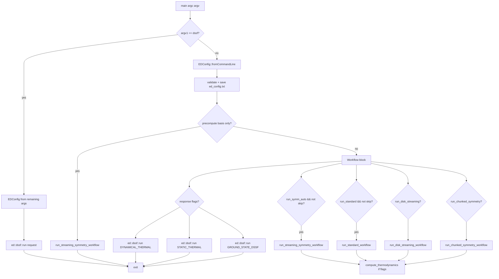
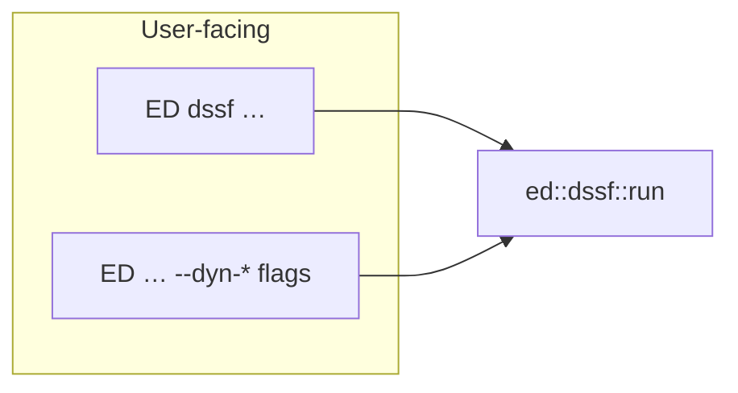

# Code map: libraries, leaves, `ED` pipeline, redundancies

This document is a **structural atlas** of the C++ tree under `include/ed/`
and `src/`, how the **`ED` binary** navigates solvers and workflows, and
where **intentional duplication** lives vs. true technical debt.

For algorithmic detail see [`IMPLEMENTATION_REPORT.md`](IMPLEMENTATION_REPORT.md).
For scaling and env knobs see [`SCALING.md`](SCALING.md).

---

## 1. CMake static libraries and executables (build graph)

Libraries are defined in [`cmake/EDLibraries.cmake`](../../cmake/EDLibraries.cmake).
The `ED` driver links a **subset** of them; not every installed archive is
linked into every binary (e.g. `ed_symmetry` is linked by `quantum_ed._core`
and unit tests, but **not** by the main `ED` executable — symmetry sectors
for `ED` typically come from JSON via `construct_ham` / file I/O).

`ed_input` is **not** in the `ED` link line — it is a *standalone* lattice
+ Hamiltonian builder library consumed by the new `examples/`, by the
`quantum_ed._core` pybind11 module (which exposes it as
`quantum_ed.input`), and by the Catch2 unit tests
(`tests/unit/test_input_library.cpp`). Its job is to **replace** the
legacy `python/edlib/helper_*.py` family with a typed, in-process API
that can either materialise an `ed::Operator` *or* emit the same
`InterAll.dat` / `Trans.dat` / `positions.dat` directory that `./ED`
already consumes — see [`usage.md` §9](../guides/usage.md#9-mode-8-standalone-ed_input-cpython-lattice--hamiltonian-builder).

*Figure: Dependency direction (not the exact CMake `target_link_libraries`
list). `ed_cli` always pulls `ed_solvers_cpu`; it **also** links
`ed_solvers_gpu` when `WITH_CUDA` is on. `ed_solvers_gpu` in turn
**PUBLIC**-links `ed_solvers_cpu`, so the `ED` executable only names
`ed_cli` + `ed_dssf` + `ed_solvers_gpu` in the CUDA case (CPU solvers
transitive). Non-CUDA `ED` links `ed_cli` + `ed_solvers_cpu` + `ed_dssf` and
omits `ed_solvers_gpu` entirely.*

---

## 2. `ED` process flow (argv → solvers)

`ed_main.cpp` is intentionally thin: **parse** → **optional workflows** →
**optional DSSF dispatch**. The heavy logic is in
[`include/ed/core/ed_wrapper.h`](../../include/ed/core/ed_wrapper.h) (thousands
of lines: `exact_diagonalization_from_files`, symmetry wrappers, GPU routing)
and in [`src/cli/workflows.cpp`](../../src/cli/workflows.cpp).

*Figure: Main-line `ED` (not the `dssf` subcommand). Multiple **basis**
workflows can be toggled in one config; the most confusing case is
`run_standard` **and** `run_symm_auto` both true — **both** runs execute and
eigenvalues are **compared** (see `ed_main.cpp`).*

**Where solvers actually run:** `run_*_workflow` calls into
`exact_diagonalization_from_directory` / streaming / disk / chunked variants in
`ed_wrapper.h` + `ed_wrapper_streaming.h` + `ed_wrapper_chunked.h` +
`disk_streaming_symmetry.h`, which **switch** on `EDConfig::method`
(`DiagonalizationMethod` in [`ed_types.h`](../../include/ed/core/ed_types.h))
and call `exact_diagonalization_core` (CPU) or GPU routes in
`gpu_ed_wrapper.cu` / `exact_diagonalization_from_files` when
`--method=*_GPU` etc.

---

## 3. DSSF: two CLI surfaces, one engine (not redundant)

| Entry | Code path |
|-------|-----------|
| `ED dssf <method> <dir> …` | `ed_main.cpp` → `ed::dssf::run` |
| `ED <dir> … --dynamical-response` / `--static-response` / `--ground-state-dssf` | Same `ed::dssf::run` via lambdas in `ed_main.cpp` |

[`src/cli/dssf_engine.cpp`](../../src/cli/dssf_engine.cpp) + `ed_dssf` hold
`build_observable_pairs` and the method dispatch. **No second copy** of the
continued-fraction / FTLM kernels for the subcommand — P2.14 removed the old
`TPQ_DSSF` binary and `--dssf` shim.

---

## 4. MPI: two different products

| Binary / API | Role |
|--------------|------|
| **`ED`** with `mpirun` | MPI-parallel *task* / sample decomposition for some methods (`mTPQ_MPI`, response parallelism, etc.) — same codebase as single-rank, but **not** the distributed-matrix SpMV path. |
| **`ed_distributed_main`** + `ed::distributed::*` | **Distributed `Operator`**: 1D slab SpMV, `MPI_Alltoallv`, `distributed_lanczos`, `distributed_ftlm`, `distributed_tpq`. **Separate** from the main `ED` static link line (links **only** `ed_distributed`). |

So “MPI” in the solver matrix can mean **task MPI inside `ED`** vs **data-parallel SpMV in `ed_distributed`** — different layers.

---

## 5. Exhaustive file leaves (`include/ed` + `src`)

Below is **every** `.h` / `.hpp` / `.cuh` / `.cpp` / `.cu` file under
`include/ed` and `src` (repository snapshot; regrow with
`find include/ed src -type f | sort` after refactors).

### 5.1 `include/ed/bfg/`

- `cli.h`, `cluster.h`, `correlations.h`, `order_parameters.h`, `results_io.h`,
  `ring_observables.h`, `spin_structure_factor.h`, `structure_factor.h`,
  `topology.h`, `wavefunction_io.h`

### 5.2 `include/ed/cli/`

- `workflows.h`

### 5.3 `include/ed/core/`

- `blas_lapack_wrapper.h`, `chunked_symmetry_builder.h`, `construct_ham.h`
  (very large: `Operator`, Hamiltonian I/O, much symmetry wiring),
- `disk_streaming_symmetry.h`, `ed_config.h`, `ed_config_adapter.h`,
  `ed_logging.h`, `ed_method_traits.h`, `ed_parameters.h`, `ed_types.h`,
- `ed_wrapper.h`, `ed_wrapper_chunked.h`, `ed_wrapper_streaming.h`,
- `hdf5_io.h`, `hdf5_symmetry_io.h`, `sorted_uint64_index.h`,
- `streaming_symmetry.h`, `system_utils.h`, `thermal_types.h`

### 5.4 `include/ed/distributed/`

- `distributed_ftlm.h`, `distributed_lanczos.h`, `distributed_lanczos_kernel.h`,
  `distributed_operator.h`, `distributed_symmetry_operator.h`,
  `distributed_tpq.h`,
- `orbit_partition.h`, `orbit_halo_plan.h`,
- `distributed_lanczos_gpu.h`, `distributed_gpu_operator.h`,
  `multi_gpu.h`, `multi_gpu_stub.h` *(back-compat shim → `multi_gpu.h`)*

### 5.5 `include/ed/dssf/`

- `dssf_engine.h`, `dssf_io.h`, `operator_spec.h`

### 5.6 `include/ed/gpu/`

- `bit_operations.cuh`, `gpu_cg.cuh`, `gpu_dynamics.cuh`, `gpu_ed_wrapper.h`,
  `gpu_ftlm.cuh`, `gpu_lanczos.cuh`, `gpu_mixed_precision.h`,
  `gpu_operator.cuh`, `gpu_tpq.cuh`, `kernel_config.h`

### 5.7 `include/ed/input/`  *(Phase 4 — replaces `python/edlib/helper_*.py`)*

- `input.h` *(umbrella header — pulls the four below)*,
- `types.h` *(`Op`, `Bond`, `Plaquette`, `Position`, `OneBodyTerm`,
  `TwoBodyTerm`, `ThreeBodyTerm`)*,
- `lattice.h` *(`Lattice` struct + `ed::input::lattice::{chain, square,
  triangular, honeycomb, kagome, pyrochlore, from_neighbor_lists,
  from_cluster_file}`)*,
- `hamiltonian_builder.h` *(fluent `HamiltonianBuilder`: low-level
  `add_one_body / add_two_body / add_three_body` + shortcuts
  `heisenberg / xxz / xyz / ising / transverse_field_ising / kitaev /
  dm / zeeman / zeeman_per_site / on_site_field / ring_exchange /
  pyrochlore_non_kramers`, plus `to_operator()` and
  `write_directory()`)*,
- `file_io.h` *(low-level `Trans.dat / InterAll.dat / ThreeBodyG.dat /
  positions.dat / one_body_correlations*.dat / two_body_correlations**.dat`
  writers + momentum-projected observable writers — these back
  `HamiltonianBuilder::write_directory`)*

### 5.8 `include/ed/io/`

- `basis_vector_storage.h`, `lanczos_basis_buffer.h`, `lanczos_checkpoint.h`,
  `lanczos_reorth.h`

### 5.9 `include/ed/parallel/`

- `numa.h`

### 5.10 `include/ed/solvers/`

- `CG.h`, `TPQ.h`, `arpack.h`, `dynamics.h`, `ftlm.h`, `hybrid_thermal.h`,
  `lanczos.h`, `ltlm.h`, `observables.h`, `scalapack_diag.h`, `tpq_seeding.h`

### 5.11 `include/ed/symmetry/`

- `group.h`

### 5.12 `src/apps/`

- `compute_bfg_order_parameters.cpp`, `compute_bfg_order_parameters_gpu.cu`,
  `ed_main.cpp`

### 5.13 `src/bfg/`

- `cli.cpp`, `cluster.cpp`, `correlations.cpp`, `order_parameters.cpp`,
  `results_io.cpp`, `ring_observables.cpp`, `spin_structure_factor.cpp`,
  `structure_factor.cpp`, `topology.cpp`, `wavefunction_io.cpp`

### 5.14 `src/cli/`

- `dssf_engine.cpp`, `ed_distributed_main.cpp`, `workflows.cpp`

### 5.15 `src/core/`

- `ed_config.cpp`

### 5.16 `src/distributed/`

- `distributed_ftlm.cpp`, `distributed_lanczos.cpp`,
  `distributed_operator.cpp`, `distributed_symmetry_operator.cpp`,
  `distributed_tpq.cpp`,
- `orbit_partition.cpp`, `orbit_halo_plan.cpp`,
- `distributed_lanczos_gpu.cu`, `distributed_gpu_operator.cu`,
  `multi_gpu.cu` *(all CUDA TUs gated on `WITH_CUDA && WITH_MPI && NCCL_FOUND`)*

### 5.17 `src/dssf/`

- `dssf_io.cpp`, `dssf_method.cpp`, `operator_spec.cpp`

### 5.18 `src/input/`  *(Phase 4 — backs `ed_input` / `quantum_ed.input`)*

- `lattice.cpp` *(implementations of every generator in
  `ed::input::lattice::*`)*,
- `hamiltonian_builder.cpp` *(fluent `HamiltonianBuilder` term
  accumulator + shortcuts; `to_operator()` / `emit_into()` /
  `write_directory()` finalisers)*,
- `file_io.cpp` *(low-level `.dat` writers driving
  `HamiltonianBuilder::write_directory`)*

### 5.19 `src/io/`

- `basis_vector_storage.cpp`, `lanczos_basis_buffer.cpp`,
  `lanczos_checkpoint.cpp`, `lanczos_reorth.cpp`

### 5.20 `src/parallel/`

- `numa.cpp`

### 5.21 `src/solvers/cpu/`

- `CG.cpp`, `TPQ.cpp`, `arpack.cpp`, `dynamics.cpp`, `ftlm.cpp`,
  `hybrid_thermal.cpp`, `lanczos.cpp`, `ltlm.cpp`, `observables.cpp`,
  `scalapack_diag.cpp` *(optional, `WITH_SCALAPACK`)*

### 5.22 `src/solvers/gpu/`

- `gpu_block_krylov_schur.cu`, `gpu_block_lanczos.cu`, `gpu_cg.cu`,
  `gpu_dynamics.cu`, `gpu_ed_wrapper.cu`, `gpu_fixed_sz_operator.cu`,
  `gpu_ftlm.cu`, `gpu_full_diag.cu`, `gpu_kernels.cu`, `gpu_krylov_schur.cu`,
  `gpu_lanczos.cu`, `gpu_mixed_precision.cu`, `gpu_operator.cu`,
  `gpu_operator_conversion.cpp`, `gpu_symmetrized_operator.cu`, `gpu_tpq.cu`,
  `lobpcg_eigen_solve.cpp`

### 5.23 `src/symmetry/`

- `group.cpp`

---

## 6. Other top-level areas (not duplicated above)

| Path | Purpose |
|------|---------|
| `python/quantum_ed/` | `pybind11` `_core` + pure Python `hamiltonian`, `dssf`, `symmetry`, `bfg`, `helpers`, **`input`** *(Phase 4 — facade for the `ed_input` C++ library)* |
| `workflows/nlce/` | Python driver that **subprocess**-launches `ED` |
| `examples/` | C++/MPI/CUDA/Python samples |
| `benchmarks/` | Google Benchmark + `bench_all_backends.py` |
| `tests/unit/` | Catch2 tests (one file per major subsystem) |

---

## 7. Redundancies and near-duplication

### 7.1 Intentional (design, not sloppiness)

- **Multiple symmetry front-ends** (`ed_wrapper_streaming.h`,
  `ed_wrapper_chunked.h`, `disk_streaming_symmetry.h`): four memory/latency
  tradeoffs for the *same* physics; code overlap is high but **not** bit-identical
  (I/O and basis iteration differ).
- **CPU + GPU solvers** (`lanczos.cpp` vs `gpu_lanczos.cu`, `TPQ.cpp` vs
  `gpu_tpq.cu`, …): separate implementations bound by regression tests
  (`test_cpu_gpu_equivalence.cpp`).
- **DSSF** kernel overlap between `workflows.cpp` response helpers and
  `dssf_engine.cpp` was **unified** under `ed::dssf::run` (P2.x); remaining
  overlap should be only thin wrappers.
- **Deprecated ARpack-style aliases** in `ed_types.h` (`LANCZOS_GPU_FIXED_SZ` …):
  kept for ABI / CLI compatibility.

### 7.2 Worth knowing (possible future consolidation)

- **`include/ed/core/construct_ham.h`**: monolithic header — central to
  `Operator` and file formats; hard to split without a large refactor.
- **`mTPQ_CUDA` vs `mTPQ_GPU`**: two parse tokens → same *family*; prefer
  documenting one preferred string (`mTPQ_GPU` matches other `*_GPU` methods).
- **`ed_distributed` vs `mTPQ_MPI`**: both use MPI, **different** algorithms
  (slab matvec / Taylor cTPQ vs microcanonical mTPQ MPI). Name similarity is
  confusing; this document + README TPQ section disambiguate.
- **`multi_gpu_stub.h`**: placeholder for future NCCL / multi-GPU work.

### 7.3 User-configuration redundancy

- Enabling **both** `run_standard` and `run_symm_auto` **on purpose** runs two
  full diagonals and prints max eigenvalue difference — useful for *validation*,
  expensive for *production*.

---

## 8. Maintenance

When you add a new `.cpp` / `.cu` or static library, update:

1. [`cmake/EDLibraries.cmake`](../../cmake/EDLibraries.cmake)
2. This file’s **§5** file list
3. If user-visible: [`README.md`](../../README.md) solver matrix and/or
   [`docs/guides/usage.md`](../guides/usage.md)

---

## Version

Generated as part of the repository documentation pass (2026). Commit the
`find` output diff whenever the tree changes materially.
