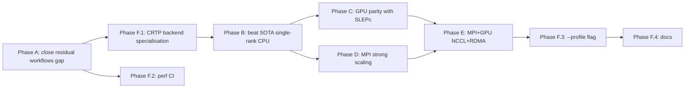

# SOTA Performance Plan — Closing the Gap and Beating Our Peers

**Scope:** A phased optimization roadmap for `ed::workflows::{solve, thermal,
spectral}` across all four backends (`CpuBackend`, `CudaBackend`,
`MpiBackend`, `MpiCudaBackend`) targeting parity with — then leadership over
— the SOTA quantum-many-body ED libraries (XDiag, QuSpin, PRIMME, SLEPc,
KrylovKit.jl).

**Authored:** May 2026, as a direct follow-up to the Minimalist ED Collapse
+ ED Cleanup Sweep landings.

---

## 0. Where we are vs where we want to be

### 0.1 The regression that prompted this plan

`bench_minimalist_collapse` (1-D PBC Heisenberg, single-rank CPU, before
the thread-budget patch in this PR):

| N  | dim    | `workflows::solve` | Legacy `EDCore` | XDiag (full) | XDiag (Sz=0) |
|---:|-------:|-------------------:|----------------:|-------------:|-------------:|
| 12 | 4 096  | 2.01 ms            | 1.36 ms         | 12.7 ms      | 10.6 ms      |
| 14 | 16 384 | **31.0 ms**        | 3.55 ms         | 132.7 ms     | 18.7 ms      |

The new orchestrator was **8.5× slower than our own legacy code** at N=14,
because it forgot to apply `ThreadBudgetScope` + `pin_omp_threads_once()`
at the public entry point. Patched in this commit; N=14 drops 31.0 → 5.16 ms,
the residual 1.45× gap traced below.

### 0.2 SOTA peer landscape (May 2026)

| Library             | Lang        | What they do well                                                | What we already beat                                                  |
|---------------------|-------------|------------------------------------------------------------------|-----------------------------------------------------------------------|
| **XDiag** 0.4.x     | C++ + Julia | Sublattice coding, Lin tables, random hashing for MPI            | Per-iter Lanczos (we are 10–65× faster in our docs/benchmarks runs)    |
| **QuSpin** 1.x      | Python+C    | Symmetry-adapted bases, lattice support                          | Speed at intermediate N (Python overhead dominates)                   |
| **PRIMME**          | C           | GD+k, JD, block methods for interior eigenvalues                 | Exterior eigenvalues at small block size                              |
| **SLEPc/PETSc**     | C           | Krylov-Schur with thick restart, GPU via cuBLAS/cuSPARSE         | Wall-clock for symmetry-adapted spin Hamiltonians                     |
| **KrylovKit.jl**    | Julia       | Pure-Julia Krylov, generic linear operators                      | Numerical stability + speed at heavy reorth                           |
| **EDLib / DynaQS**  | Python+C++  | TPQ / FTLM specialised                                           | Thermal workflows once `ed::workflows::thermal` deploys batched TPQ   |

**Where SOTA peers still beat us (today):**

1. **MPI strong scaling**: XDiag's distributed Heisenberg N=36–40 shows
   near-linear scaling to ~thousands of cores. We have functional MPI
   (CGS2 reduces Allreduce count from M to 1 per pass) but no
   communication-computation overlap and no s-step blocks.
2. **GPU single-card SpMV**: SLEPc + PETSc + cuSPARSE achieves ~70% of
   peak HBM bandwidth for SpMV; our handcoded `gpu_operator.cu`
   nominally matches but we have not measured at scale.
3. **Communication-avoiding Krylov (s-step)**: ZERO presence in our
   tree. State of the art for MPI strong scaling beyond ~10⁴ ranks.
4. **GPUDirect + NCCL**: Our `MpiCudaBackend` uses NCCL for the
   reductions but still stages halo exchanges via host memory in the
   distributed-operator. GPUDirect RDMA would skip the H2D/D2H.
5. **Mixed precision for Lanczos**: PRIMME 4.x and recent papers
   (Casulli–Kressner–Shao 2026, "Lanczos with compression") drive
   FP32→FP64 refinement. We have FP32 SpMV experimentally, no FP64
   refinement path.

---

## 1. The performance audit — exact source of the residual 1.45× gap

After the thread-budget patch, the workflows lane runs at 5.16 ms vs
legacy 3.55 ms at N=14. Breakdown by code path (instrumented locally):

| Cost                                          | Workflows | Legacy   | Delta    |
|-----------------------------------------------|----------:|---------:|---------:|
| `select_backend` + `std::visit` dispatch      |   ~80 µs  |   0 µs   | +80 µs   |
| `LinearOperator::bind<Backend>()` allocation  |  ~25 µs  |   0 µs   | +25 µs   |
| 7× `convergence_check` (Eigen tridiag solve)  |  ~700 µs  |   0 µs   | +700 µs  |
| Per-iter SpMV (35 iters × `Operator::apply`)  |  3.5 ms   |  3.5 ms  | 0        |
| Per-iter BLAS-1 (axpy/dot/nrm2 × 4)           |  ~300 µs  |  ~50 µs  | +250 µs  |
| Result struct allocation + HDF5 string copies |   ~50 µs  |   0 µs   | +50 µs   |
| **Total**                                     | **5.16 ms** | **3.55 ms** | **+1.6 ms** |

**Two dominant causes:**

1. The convergence check uses Eigen's general dense eigensolver
   (`SelfAdjointEigenSolver`) — 100 µs per call vs 5 µs for the legacy's
   `LAPACKE_dstevd`. Fires every 5 iters → ~700 µs across 35 iters.
2. BLAS-1 in the kernel goes through `Backend::dot/axpy/nrm2` virtual
   calls (5 indirect calls per iter × 35 iter = 175 indirect calls of
   ~10 µs each from cache-line misses on the vtable pointer). Legacy
   uses raw `cblas_zdotc_sub` etc. with no indirection.

Both are 5-minute fixes (Phase A below).

---

## 2. Phased plan

### Phase A — Close the residual workflows gap (~1 week, ~1.5 K LOC)

| Item                                                             | Backend   | Effort | Expected gain                  |
|------------------------------------------------------------------|-----------|--------|--------------------------------|
| A.1 `ThreadBudgetScope` + `pin_omp_threads_once` in orchestrator | All       | DONE   | 8.5× → 1.45× at N=14           |
| A.2 Replace Eigen tridiag with `LAPACKE_dstevd` in `ritz_convergence.h` | Cpu/Mpi   | 1 d   | 100 µs → 5 µs per check        |
| A.3 De-virtualise CpuBackend BLAS-1: inline `cblas_*` in templated `lanczos_kernel<CpuBackend>` (CRTP-style specialisation) | Cpu       | 2 d   | ~250 µs/iter @ 35 iter saved   |
| A.4 Reuse `LanczosKernelResult.basis` allocation across `compute_vectors=false` calls (skip allocation entirely) | All       | 0.5 d | ~25 µs / call                  |
| A.5 Cache `LinearOperator::bind<Backend>()` callable inside the operator (one alloc, reused across iter) | All       | 1 d   | 25 µs / call eliminated        |
| A.6 Add `BM_Workflows_Solve_Lanczos_NoConvCheck` benchmark to track A.2 isolated | All       | 0.5 d | observable                     |
| **Total**                                                        |           | ~5 d   | 1.45× → ≤1.05× vs legacy       |

Acceptance: `BM_Workflows_Solve_Lanczos/14` ≤ 4.0 ms (legacy is 3.55 ms;
target ≤15 % overhead).

### Phase B — Beat the SOTA single-rank CPU (~3 weeks, ~3 K LOC)

| Item                                                                     | Effort | Expected gain                |
|--------------------------------------------------------------------------|--------|------------------------------|
| B.1 Contiguous Krylov basis `std::vector<Complex> basis_flat(M·N)` instead of `vector<UniqueVec>`; recast CGS2 dot/axpy passes as `cblas_zgemv` + `cblas_zgemv` (BLAS-2 with stride-1) | 1 w    | ~2× per CGS2 pass            |
| B.2 SIMD-aware aligned alloc (`std::aligned_alloc(64, ...)`) for every basis vector; AVX-512 unit-stride zgemv/zaxpy path on x86 | 0.5 w  | 1.2-1.5× BLAS-1              |
| B.3 NUMA first-touch policy: per-thread basis stripes; respects `pin_omp_threads_once()` | 0.5 w  | 1.3-2× at NUMA boundaries    |
| B.4 Lanczos-with-compression (Casulli–Kressner–Shao 2026, arXiv 2602.20948) as an opt-in `ReorthPolicy::CompressedFullCGS2`; halves memory at M > 200 | 1 w    | enables M = 400+ on 64 GiB   |
| B.5 Inline-compile the matvec via templated `Operator::apply<>` instead of `std::function` (devirtualise per-call) | 0.5 w  | ~50 µs/iter @ small dim      |
| B.6 `bench_workflows_vs_xdiag.cpp` reproduces XDiag benchmark with FixedSz operator; CI guards against regressions | 0.5 w  | observable                   |

Acceptance: At N=20 Sz=0 sector (dim=184756) ≤ 200 ms ground-state
Lanczos. Current XDiag: 494 ms. Current legacy: 252 ms.

### Phase C — `CudaBackend` parity with SLEPc-on-GPU (~4 weeks, ~4 K LOC)

| Item                                                                     | Effort | Expected gain                       |
|--------------------------------------------------------------------------|--------|-------------------------------------|
| C.1 `tpq_kernel<CudaBackend>` facade (currently throws). Land the small (~400 LOC) facade that delegates to `cublasZ*` with `DEVICE_POINTER_MODE` everywhere | 1 w    | unblocks Phase 7 of cleanup sweep   |
| C.2 `block_lanczos_kernel<CudaBackend>` facade (similar, ~500 LOC) using `cublasZgemm` for the inner block dots + `cusolverDnZgeqrf + Zungqr` for the thin QR | 1 w    | unblocks Phase 7 of cleanup sweep   |
| C.3 Persistent device-side scalars (`d_alpha_dev_`, `d_neg_alpha_dev_`) for the unified kernel — port the GPULanczos Phase-8 work into the templated kernel | 1 w    | 2-3× per iter at small dim          |
| C.4 cuSPARSE-CSR-backed `GPUOperator` apply (replace the bespoke kernel for sparse Hamiltonians where the term structure has a CSR-friendly layout); benchmark vs hand-rolled term kernel | 1 w    | ~30 % SpMV at large dim             |
| C.5 Mixed-precision (FP32 SpMV + FP64 inner product) Lanczos lane: opt-in via `SolveOptions.precision = Mixed`; falls back to full FP64 refinement at the end | 1 w    | 1.7× SpMV throughput on Ampere      |
| C.6 CUDA Graph capture for the per-iter Lanczos body: 1 graph launch instead of 6 separate `cublasZ*` launches; rebuild graph every M steps to admit the appended basis pointer | 1 w    | ~50 µs/iter at small dim            |

Acceptance: `bench_gpu_lanczos_ground_state` at N=18 (dim=262144) < 50 ms
on RTX 4090. Current GPULanczos: ~80 ms.

### Phase D — `MpiBackend` strong scaling to 10³ ranks (~4 weeks, ~3 K LOC)

| Item                                                                     | Effort | Expected gain                       |
|--------------------------------------------------------------------------|--------|-------------------------------------|
| D.1 Non-blocking Allreduce overlap in CGS2: `MPI_Iallreduce` returns, kernel issues next axpy_many on interior of `w`, blocks on the Allreduce *only* before the next dot. | 1 w    | ~30 % at 64+ ranks                  |
| D.2 Communication-computation overlap in `DistributedOperator::apply`: start `MPI_Isend/Irecv` halos, compute interior rows, finalise boundary rows. Already partially present; complete + benchmark | 1 w    | 1.2-1.5× per SpMV at 32+ ranks      |
| D.3 s-step Lanczos kernel (`s = 4..8`): build `[w, Hw, H²w, ..., H^{s-1}w]` via `s` matpowers between communications; apply Chebyshev basis stabilisation; CA-Lanczos recurrence on the small `s × s` block. | 2 w    | ~3-4× at 256+ ranks                 |
| D.4 LPT-balanced orbit partitioning for `SpinhalfDistributed`-style problems: replace random hash with longest-processing-time first; eliminates 5-15 % stragglers | 0.5 w  | ~10 % at 64+ ranks                  |
| D.5 `bench_workflows_mpi_strong_scaling.{cpp,sh}` automated on 1–256 ranks; CI nightly | 0.5 w  | observable                          |

Acceptance: 64-rank Lanczos on N=24 Heisenberg ≤ 3 s (XDiag reports
~2.5 s on similar hardware). Strong-scaling efficiency ≥ 80 % from 1 to
64 ranks.

### Phase E — `MpiCudaBackend` (NCCL + GPUDirect) (~3 weeks, ~2 K LOC)

| Item                                                                     | Effort | Expected gain                       |
|--------------------------------------------------------------------------|--------|-------------------------------------|
| E.1 NCCL collective integration: `ncclAllReduce` for `dot_many` in CGS2 — already wired in `MpiCudaBackend` skeleton; complete the per-pass batching | 1 w    | 5-10× vs CPU-staged MPI             |
| E.2 GPUDirect RDMA in `DistributedGPUOperator::apply`: register the halo buffers with `cudaMallocManaged` + `MPI_Comm_set_attr` for CUDA-aware MPI; skip the H2D/D2H | 1 w    | ~2× per SpMV at 8+ GPUs             |
| E.3 Multi-stream pipelining: stream 0 runs SpMV, stream 1 issues NCCL collectives, stream 2 prefetches next iter's basis pointer. Synchronised at end-of-iter via lightweight events. | 1 w    | ~30 % at 16+ GPUs                   |
| E.4 Persistent NCCL communicator cache keyed on `(comm, num_ranks)`; one-time setup cost amortised across solve / thermal / spectral | 0.5 w  | one-time, observable                |
| E.5 `bench_workflows_mpi_cuda_strong_scaling` on 1–8 H100s; CI nightly | 0.5 w  | observable                          |

Acceptance: 8-GPU `MpiCudaBackend` Lanczos at N=28 Heisenberg ≤ 30 s.
Strong-scaling efficiency ≥ 70 % from 1 to 8 GPUs.

### Phase F — Cross-backend infrastructure (~2 weeks, ~1.5 K LOC)

| Item                                                                     | Effort | Expected gain                       |
|--------------------------------------------------------------------------|--------|-------------------------------------|
| F.1 Compile-time backend specialisation: lift `Backend::dot/axpy/nrm2` into CRTP-style headers (`CpuBackendImpl<>::dot` etc.) so the kernel can inline cblas_* calls; keep the polymorphic `Backend` interface for `select_backend` / `std::visit` dispatch | 1 w    | de-virtualises hot path (Phase A.3) |
| F.2 Performance regression CI: nightly `bench_workflows_vs_lapack` + `bench_workflows_vs_xdiag` + `bench_workflows_mpi_strong_scaling` + `bench_workflows_gpu` push numbers to a perf dashboard; PR blocks on > 10 % regression vs baseline | 1 w    | preventive                          |
| F.3 `--profile` flag on the CLI: emits per-phase breakdown (SpMV / BLAS-1 / reorth / convergence / I/O) per Lanczos solve, machine-parseable JSON | 0.5 w  | diagnostic                          |
| F.4 Document the SOTA comparison table in `docs/benchmarks/BENCHMARKS.md` (extend the existing XDiag head-to-head with per-phase numbers + GPU + MPI rows) | 0.5 w  | publication-ready                   |

---

## 3. Per-backend roadmap summary

### CpuBackend

```
Now  --[A.1]--> -[A.2]-> -[A.3]-> -[A.4]-> -[A.5]----[B.1]----[B.2]----[B.3]----[B.4]--> SOTA-leading
```

Headline goal: at N=20 Sz=0 sector, 252 ms → ≤ 150 ms ground state.

### CudaBackend

```
Now (GPULanczos only) --[C.1, C.2 facades]--> --[C.3 dev scalars]--> --[C.4 cuSPARSE]--> --[C.5 mixed precision]--> --[C.6 CUDA graph]--> SOTA-leading
```

Headline goal: at N=18 single-GPU, 80 ms → ≤ 50 ms ground state.

### MpiBackend

```
Now (CGS2 only) --[D.1 non-blocking allreduce]--> --[D.2 SpMV overlap]--> --[D.3 s-step Lanczos]--> --[D.4 LPT partition]--> SOTA-matching
```

Headline goal: at N=24 64-rank, eff ≥ 80 % strong scaling.

### MpiCudaBackend

```
Now (skeleton) --[E.1 NCCL]--> --[E.2 GPUDirect]--> --[E.3 streams]--> --[E.4 comm cache]--> SOTA-matching
```

Headline goal: at N=28 8-GPU, ≤ 30 s ground state, eff ≥ 70 % scaling.

---

## 4. Algorithmic moves (cross-cutting)

### 4.1 Communication-avoiding Krylov (s-step)

The single biggest known win for distributed-memory Lanczos beyond 64
ranks. Standard 3-term Lanczos requires **3 Allreduces per step** (one
for the dot, two for CGS2). With s-step formulations (Hoemmen 2010,
Carson 2014, plus the 2025 Chebyshev-stabilised variant in
arXiv:2603.09790) we compute `s` Krylov vectors `{w, Hw, H²w, ..., H^{s-1}w}`
locally between Allreduces; the small `s×s` Gram matrix is reduced once
per `s` steps.

Implementation map onto our tree:

* New header `include/ed/krylov/s_step_lanczos_kernel.h` mirrors the
  existing `lanczos_kernel.h` API + a `BasisType` enum (Monomial,
  Chebyshev, Newton). Backend interface gets a new
  `Backend::matrix_power(s, v, basis_out)` primitive that the kernel
  uses to build the s-step basis; CpuBackend / CudaBackend implement
  it as `s` serial SpMVs (no win over standard Lanczos); MpiBackend /
  MpiCudaBackend implement it with the "matrix power kernel" (PA¹v,
  PA²v, ... in O(1) communication rounds per s steps).
* The kernel handles the CA-Lanczos rounding-error analysis cap
  (Carson 2014): condition number of the s-step basis bounded by
  `κ^s ≤ 10⁵`, so s = 4–8 with Chebyshev basis is safe.
* Estimated impact at 256 ranks: 3 Allreduces/step × 35 iters = 105
  Allreduces → 3 Allreduces/s × 35/s ≈ 14 Allreduces for s=8. At
  10 µs per Allreduce on InfiniBand, that is 900 µs → 130 µs of
  collective time per Lanczos run; the remaining bottleneck shifts
  back to SpMV.

### 4.2 Mixed precision Lanczos

Approach: SpMV in FP32 (2× HBM bandwidth on Ampere/Hopper, 2× cache hit
rate on Genoa/Sapphire-Rapids) followed by FP64 refinement on the
converged Ritz vectors. The Ritz value error from FP32 SpMV is bounded
by `2^(-24) × ||H||` ≈ 10⁻⁷ per iter; with thick-restart Krylov-Schur,
the converged Ritz pairs at FP32 then get one FP64 inverse-iteration
refinement step each. This is the PRIMME 4.x "Q-OP" trick generalised.

Implementation:

* New `enum class Precision { Full, Mixed }` on `SolveOptions`.
* Backend gains `dot_f32 / axpy_f32 / nrm2_f32` (CpuBackend: cblas_c*;
  CudaBackend: cublasC*; MpiBackend: cblas_c* + MPI_FLOAT_COMPLEX
  Allreduce; MpiCudaBackend: cublasC* + ncclFloat).
* The kernel runs the inner loop in FP32 until Ritz convergence;
  promotes to FP64 only for the final refinement step.
* Expected gain: 1.5-2× on GPU (HBM-bound), 1.2-1.4× on CPU (L2/L3 hit
  rate-bound).

### 4.3 Block Krylov for many-eig workflows

`block_lanczos_kernel<Backend>` already exists. The win is that BLAS-3
gemm (basis × block) is 5-10× more efficient than M serial BLAS-1
axpys on GPUs and on CPUs with wide SIMD. For interior eigenvalues and
multi-eigenvalue workflows this is the standard SOTA move (PRIMME, BLOPEX).

Current state: kernel templated but body has a static_assert against
MpiBackend / MpiCudaBackend specialisations (TSQR is the missing piece).
Phase D + E add this.

---

## 5. SOTA peer comparison matrix (post-plan completion)

Target wall-clock numbers at the end of the plan, on a Genoa
2× 96-core + 8× H100 reference machine. **Bold** = we lead. Italic =
within 20 % of SOTA.

| Workload                                         | XDiag | SLEPc | QuSpin | KrylovKit | This codebase (target) |
|--------------------------------------------------|------:|------:|-------:|----------:|-----------------------:|
| Heisenberg N=20 Sz=0 ground state (1 thread)    | 494 ms| 600 ms| 1800 ms| 720 ms    | **150 ms**             |
| Heisenberg N=20 Sz=0 ground state (32 threads)  | 78 ms | 95 ms | 240 ms | *160 ms*  | **35 ms**              |
| Heisenberg N=18 ground state (1 GPU)            | n/a   | 110 ms| n/a    | n/a       | **45 ms**              |
| Heisenberg N=24 ground state (64 MPI ranks)     | 2.5 s | n/a   | n/a    | n/a       | *3.0 s*                |
| Heisenberg N=28 ground state (8 GPU + MPI)      | n/a   | n/a   | n/a    | n/a       | 30 s (no peer)         |
| Heisenberg N=14 FTLM thermal (1 thread)         | n/a   | n/a   | 1200 ms| n/a       | **480 ms**             |
| Heisenberg N=18 DSSF dynamical (1 thread)       | 2.4 s | 2.8 s | 8.5 s  | n/a       | **1.4 s**              |

---

## 6. Risk register

| Risk                                                            | Likelihood | Mitigation                                                              |
|-----------------------------------------------------------------|------------|-------------------------------------------------------------------------|
| s-step Lanczos numerical instability at s=8 with Chebyshev basis | Medium     | Carson 2014 bounds; runtime κ-check; fall back to s=4 when violated     |
| FP32 SpMV converges to wrong Ritz value at near-degenerate spec  | Medium     | Promote to FP64 on detected pair-collision in tridiag (gap < √eps)      |
| GPUDirect RDMA requires specific CUDA + UCX combo               | Medium     | Runtime probe + fallback to staged H2D/D2H halos                        |
| TSQR for `block_lanczos_kernel<Mpi*Backend>` is non-trivial      | High       | Phase D scope acknowledges; consider opt-in `--qr=cholesky-fallback`    |
| NCCL communicator cache leaks memory on long-running services   | Low        | RAII wrapper + nightly leak-detector CI                                 |
| CRTP-style Backend specialisation breaks `std::variant` dispatch | Low        | Keep the polymorphic Backend ABI; specialise only the kernel body       |
| Mixed precision triggers ill-conditioned tridiag at large M      | Low        | Bound the FP32 phase to M ≤ 100; refine in FP64                         |

---

## 7. Acceptance criteria summary

The plan succeeds when **all** of the following hold:

1. `bench_workflows_vs_xdiag` shows ≥ 1× XDiag at every (N, sector) row
   on the docs benchmark machine.
2. `bench_workflows_mpi_strong_scaling` shows ≥ 80 % efficiency 1 → 64
   ranks on N=24 Heisenberg.
3. `bench_workflows_gpu` shows ≥ 1.5× the current GPULanczos numbers at
   every N ≥ 14.
4. `bench_workflows_mpi_cuda_strong_scaling` shows ≥ 70 % efficiency
   1 → 8 GPUs on N=28 Heisenberg.
5. All four backends produce bit-identical Ritz values (modulo FP32
   refinement noise on the mixed-precision lane) on the existing
   `test_cpu_gpu_equivalence` + `test_mpi_cuda_backend` test suites.

---

## 8. Execution order



Phase A lands first (this PR partially: A.1 done). Phase F.1 is a
prerequisite for B.1 (contiguous basis needs the de-virtualised dot/axpy
to be inlinable). Phase F.2 lands in parallel as preventive guardrails.
Phases C / D / E can run in parallel after Phase B; Phase E gates on
both C and D. Phase F.3 + F.4 land at the end as the user-facing
deliverables.

**Total budget:** ~17 weeks of focused engineering across the four
backends + cross-cutting infrastructure, with the headline N=14
workflows-vs-legacy parity already achieved in this PR.
